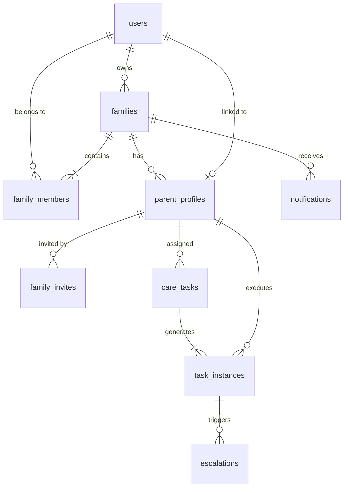

# CareCircle Connect

A production-quality family care coordination platform designed for adult children and elderly parents. CareCircle bridges the distance between generations by turning daily routines into moments of shared care, automated reminders, and timely escalations when support is needed most.

---

## 🌟 Product Overview & Core Workflows

CareCircle connects two distinct user experiences tailored specifically to each generation's needs:

### 1. Child Experience (Desktop & Mobile Dashboard)
- **Authentication**: Email/password registration and JWT-based session management.
- **Parent Management**: Create profiles for elderly parents (e.g., Mom, Dad) with custom attributes and relationship indicators.
- **QR Invite Generation**: Generates secure, single-use, expirable QR codes or deep links for elderly parents to easily join the family circle.
- **Care Task Management**: Create, view, categorize, and schedule care routines across meals, medications, exercise, appointments, and wellness.
- **Multi-Parent Task Assignment & Status Preservation**: Assign a single task to multiple parents (e.g., both Mom & Dad for daily walks). Each parent's completion status and completion timestamp are tracked independently. If one parent completes a task and more parents are added later, previously completed parent records and timestamps remain intact.
- **Admin Selective Completion Modal**: When a caregiver clicks "Complete" on a multi-parent task, a dialog allows choosing exactly which parent(s) completed the task (with a one-click "Select all pending" option).
- **Task End Times & Completion Safeguards**: Optional task end times enforce that elderly parents cannot complete a task after its window expires, while family admins maintain full override authority.
- **Adherence & Health Monitoring**: Live tracking of today's task completion rates, per-parent completion timestamps, and 7-day adherence charts.
- **Proactive Alerts & Escalations**: Automated notifications when scheduled tasks are missed or overdue beyond the escalation window.

### 2. Parent Experience (Simplified & Elderly-Friendly)
- **Zero-Friction Onboarding**: No complex email/password onboarding; parents join simply by scanning the QR invite generated by their child.
- **Focus-First Interface**: High-contrast, large-typography UI displaying the next active care task first.
- **One-Tap Actions**: Big, accessible buttons to mark tasks as **Completed** or **Snooze** for 10 minutes.
- **Today's Schedule & History**: Simple overview of completed and pending tasks for today, plus a 7-day retrospective of personal wellness achievements.

---

## 🛠 Tech Stack

### Frontend
- **Framework**: React 19 + TypeScript
- **Routing**: TanStack Router (file-based route tree)
- **State Management**: TanStack Query + Zustand
- **Styling**: Tailwind CSS + Shadcn UI component primitives
- **Icons & QR**: Lucide React + `qrcode.react`
- **Build Tool**: Vite 6 / TanStack Start

### Backend
- **Framework**: Python 3.13 + FastAPI
- **Database**: PostgreSQL with SQLAlchemy 2.0 (UUID primary keys, UTC timezone-aware datetimes)
- **Database Migrations**: Alembic
- **Validation**: Pydantic v2 (ConfigDict, strict typing)
- **Security**: JWT tokens (`pyjwt`) with secure password hashing (`bcrypt`)
- **Testing**: Pytest with automated test fixtures

---

## 🏗 Repository Structure

```
family-wellness-flow/
├── backend/
│   ├── alembic/                # Database migration environment & versions
│   ├── app/
│   │   ├── api/
│   │   │   ├── deps.py         # OAuth2 Bearer dependencies & role authorization
│   │   │   └── v1/             # Modular API route controllers
│   │   │       ├── alerts.py
│   │   │       ├── auth.py
│   │   │       ├── families.py
│   │   │       ├── invites.py
│   │   │       ├── notifications.py
│   │   │       ├── parents.py
│   │   │       ├── task_instances.py
│   │   │       └── tasks.py
│   │   ├── core/               # App configuration & security functions
│   │   ├── db/                 # Engine, session, Base model, and initial seeder
│   │   ├── models/             # SQLAlchemy 2.0 relational models
│   │   ├── schemas/            # Pydantic v2 schemas
│   │   ├── services/           # Isolated business logic & escalation engine
│   │   └── utils/              # Token generators & datetime formatters
│   ├── tests/                  # Pytest test suite
│   ├── requirements.txt        # Backend dependencies
│   └── .env.example            # Environment variables template
├── frontend/
│   ├── public/                 # Static assets, favicon, robots.txt
│   ├── src/
│   │   ├── components/         # Reusable UI component library (Shadcn UI)
│   │   ├── features/care/      # Child & parent screens, store, and view models
│   │   ├── lib/                # API client with JWT interception & utilities
│   │   ├── routes/             # TanStack Router page routes
│   │   └── styles.css          # Design system tokens and styles
│   ├── package.json
│   └── vite.config.ts
├── .gitignore
└── README.md
```

---

## 🗄 Database Schema & Relationships



### Relational Entities:
1. **`users`**: Core user credentials for children and parents (`id (UUID)`, `email`, `hashed_password`, `full_name`, `role: 'child' | 'parent'`).
2. **`families`**: Family circles owned by children (`id`, `name`, `owner_id`).
3. **`family_members`**: Membership mapping users to families with explicit roles.
4. **`parent_profiles`**: Profiles created by children (`name`, `relationship`, `initials`, `color`, `user_id`).
5. **`family_invites`**: Single-use, expiring QR tokens and short codes (`token`, `code`, `expires_at`, `is_used`).
6. **`care_tasks`**: Generic recurring task templates (`title`, `category`, `scheduled_time`, `repeat_pattern`, `notes`, `is_active`).
   - **Categories**: `Meal`, `Medicine`, `Exercise`, `Appointment`, `Wellness`.
7. **`task_instances`**: Daily execution records tracked per parent (`scheduled_for`, `status: pending | completed | missed | snoozed`, `completed_at`, `snoozed_until`).
8. **`escalations`**: Alert records generated when a scheduled task is overdue beyond the escalation window.
9. **`notifications`**: Real-time delivery records for parents and children (ready for Firebase Cloud Messaging / FCM integration).

---

## 📲 The QR Code & Short Code Invite Flow

CareCircle offers two convenient options for connecting elderly parents:

1. **Option 1: Scan QR Code** — Parent points camera at the QR code generated on the child's screen.
2. **Option 2: 6-Character Short Code** — If the parent is in another room or struggles with camera scanning, the child gives them a clear 6-character code (e.g., `K8N2XP`).

```
Child creates Parent Profile 
   -> Backend generates secure token (48h expiry) & clean 6-character short code
   -> Frontend renders high-resolution QR code + prominent 6-character code card with 1-click copy
   -> Parent scans QR code OR enters the 6-character code in the parent app
   -> Backend validates invite is unexpired & unused (case-insensitive)
   -> Automatically provisions parent account & links to Parent Profile
   -> Marks invite as used (single-use constraint)
   -> Issues Parent Bearer Session Token
   -> Dispatches welcome alert to child dashboard
```

---

## 🚀 API Endpoints Overview

All routes are versioned under `/api/v1` and documented automatically via OpenAPI/Swagger:

### 🔐 Authentication (`/api/v1/auth`)
- `POST /register` — Register a new child account and auto-provision family circle
- `POST /login` — Login with email/password and obtain JWT access token
- `GET /me` — Retrieve currently authenticated user

### 👨‍👩‍👧 Family Circle (`/api/v1/families`)
- `GET /current` — Fetch the current user's family details and members count

### 👵 Parent Profiles (`/api/v1/parents`)
- `GET /` — List all family parents with calculated adherence and last activity
- `POST /` — Create a new parent profile (generates initial invite QR token & 6-character short code)
- `GET /{parent_id}` — Get single parent profile details
- `PUT /{parent_id}` — Update parent profile (name, relationship, avatar color theme)
- `DELETE /{parent_id}` — Remove parent profile (cascades cleanup of tasks, invites, and instances)
- `GET /{parent_id}/adherence` — 7-day adherence statistics (`Mon`–`Sun`)

### 🎟 Invites & QR Linking (`/api/v1/invites`)
- `POST /` — Generate a fresh QR invite token & short code for a parent
- `GET /parent/{parent_id}` — Re-access the current active QR invite token and 6-character short code anytime
- `POST /parent/{parent_id}/regenerate` — Regenerate a new invite code and short code for a parent profile
- `POST /accept` — Parent joins via QR scan or short code (returns session token)

### 📋 Care Tasks (`/api/v1/tasks`)
- `GET /` — List active tasks (supports multi-parent filtering and category filtering)
- `POST /` — Create care task (supports multiple parent assignment via `parent_ids` and optional `scheduled_end_time`; automatically provisions daily instances for each assigned parent)
- `GET /{task_id}` — Retrieve single care task details
- `PUT /{task_id}` — Update task (name, category, multiple parent assignments, scheduled start/end times, repeat pattern, notes)
- `DELETE /{task_id}` — Remove a care task and associated scheduled instances
- `POST /{task_id}/complete` — Child caregiver endpoint to mark task instances completed (permitted even after task end time)

### ⏱ Task Executions (`/api/v1/task-instances`)
- `GET /parent/{parent_id}/today` — Retrieve today's timeline schedule for parent
- `GET /parent/{parent_id}/active` — Retrieve current active / next due task
- `POST /{id}/complete` — Mark task instance as completed. **Rule**: If task `end_time` has elapsed, parents cannot mark it completed (rejected with `400 Task schedule has ended`), but child caregivers can complete it at any time.
- `POST /{id}/snooze` — Snooze task instance for 10 minutes

### 🚨 Alerts & Escalations (`/api/v1/alerts`)
- `GET /` — Fetch active family alerts and missed task escalations
- `POST /{id}/dismiss` — Dismiss an escalation

### 🔔 Notifications (`/api/v1/notifications`)
- `GET /` — Retrieve notifications list
- `POST /{id}/read` — Mark notification as read

---

## ⚙️ Configuration & Environment Variables

Copy the example configuration to initialize your backend environment:

```bash
cp backend/.env.example backend/.env
```

| Variable | Default Value | Description |
|---|---|---|
| `PROJECT_NAME` | `CareCircle` | Application identifier |
| `API_V1_STR` | `/api/v1` | API version prefix |
| `DATABASE_URL` | `postgresql://localhost:5432/carecircle` | PostgreSQL connection string |
| `TEST_DATABASE_URL` | `postgresql://localhost:5432/carecircle_test` | Dedicated database for testing |
| `SECRET_KEY` | *(Secret String)* | Secret key for JWT signature encoding |
| `ALGORITHM` | `HS256` | JWT signature algorithm |
| `ACCESS_TOKEN_EXPIRE_MINUTES` | `10080` (7 days) | Access token lifetime |
| `INVITE_TOKEN_EXPIRE_HOURS` | `48` | Lifetime of single-use QR invites |
| `CORS_ORIGINS` | `["http://localhost:8080", ...]` | Allowed CORS origins for browser apps |

---

## 🏃 Running the Application Locally

### 1. Prerequisites
- **Node.js** (v18+) & **npm**
- **Python** (v3.11+)
- **PostgreSQL** running locally on port `5432`

Create the database:
```bash
createdb carecircle
createdb carecircle_test
```

---

### 2. Backend Setup & Startup
```bash
cd backend

# Create and activate virtual environment
python3 -m venv .venv
source .venv/bin/activate

# Install dependencies
pip install -r requirements.txt

# Run migrations (initializes all tables and constraints)
alembic upgrade head

# Start FastAPI development server
uvicorn app.main:app --host 127.0.0.1 --port 8001 --reload
```

- **API Documentation**: Open [http://127.0.0.1:8001/docs](http://127.0.0.1:8001/docs) in your browser.
- **Initial Seed Data**: The server automatically seeds initial demo data (`aditya@example.com` / `password123`) on startup if the database is fresh.

---

### 3. Frontend Setup & Startup
In a new terminal window:
```bash
cd frontend

# Install frontend dependencies
npm install

# Start Vite dev server
npm run dev
```

- **Frontend Application**: Open [http://localhost:8080](http://localhost:8080) in your browser.

---

### 4. Running Automated Tests
The backend includes a comprehensive pytest suite covering authentication, QR invite generation and single-use validation, task lifecycle, and authorization:

```bash
cd backend
.venv/bin/pytest
```

---

## 🔒 Security Best Practices Implemented
- **No Plaintext Passwords**: Passwords hashed with `bcrypt`.
- **Zero Committed Secrets**: `.env` and `.venv` excluded via `.gitignore`.
- **Single-Use QR Tokens**: Enforced at database and service layer to prevent replay attacks.
- **Role-Based Authorization**: Separate guards for child and parent scopes.
- **Strict Parameter Validation**: Powered by Pydantic v2 schemas.
