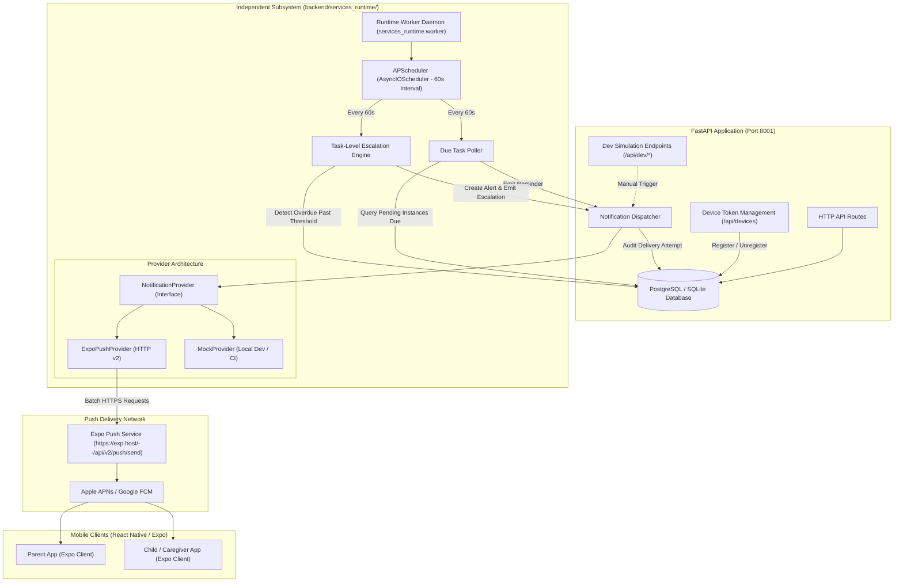
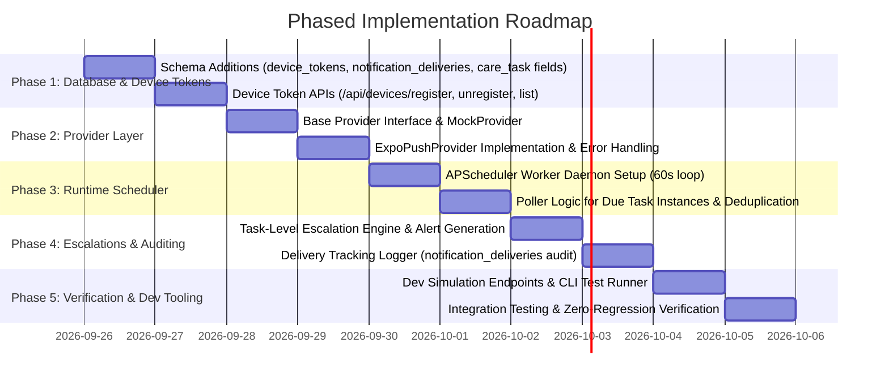

# Revised Implementation Plan: `backend/services_runtime` Subsystem (MVP)

## 1. MVP Philosophy & Core Workflow

CareCircle is focused on executing **one core workflow** with high reliability, minimal architectural bloat, and zero regressions:

```
Child creates care task
  → Parent receives reminder on mobile (Expo Push)
  → Parent completes OR ignores
  → Escalation occurs automatically if overdue
  → Child (caregiver) is notified immediately
```

All non-essential delivery channels (SMS, Twilio, WhatsApp, transactional email digests, browser-based WebPush) are **explicitly eliminated from the MVP scope**. 

The mobile application strategy is centered on **React Native + Expo**. The runtime subsystem is designed around **Expo Push Notifications** (`ExponentPushToken[...]`), with a pluggable provider abstraction, device token registry, delivery attempt auditing, and an **APScheduler** background daemon running at a 60-second polling cadence.

---

## 2. Revised Architecture Diagram



---

## 3. Subsystem Directory Structure

The subsystem lives in `backend/services_runtime/`, completely isolated from FastAPI's request-response lifecycle:

```
backend/services_runtime/
├── __init__.py
├── config.py                 # Runtime settings (POLL_INTERVAL=60, default escalation thresholds, Expo token)
├── worker.py                 # Standalone daemon entrypoint (python -m services_runtime.worker)
├── lifespan.py               # Optional development lifespan hook for FastAPI
│
├── scheduler/
│   ├── __init__.py
│   ├── runner.py             # APScheduler AsyncIOScheduler configuration & job registration
│   └── poller.py             # Minute-level scanner for due task instances
│
├── escalations/
│   ├── __init__.py
│   └── engine.py             # Evaluates overdue tasks against task-level thresholds
│
└── delivery/
    ├── __init__.py
    ├── base.py               # Abstract NotificationProvider interface & data schemas
    ├── dispatcher.py         # Recipient resolution, token lookup, deduplication & delivery logging
    └── providers/
        ├── __init__.py
        ├── expo.py           # ExpoPushProvider (httpx client to https://exp.host/--/api/v2/push/send)
        └── mock.py           # MockProvider (in-memory logger for test suites & dev)
```

---

## 4. Database Schema Additions

To support multi-device push routing and delivery auditing without altering existing tables, we add two new additive tables and two optional configuration fields to `CareTask`.

### 4.1 `device_tokens` Table
Tracks push tokens across multiple physical devices per user.

| Column | Type | Constraints / Description |
|---|---|---|
| `id` | `VARCHAR(36)` | Primary Key (UUIDv4) |
| `user_id` | `VARCHAR(36)` | Foreign Key -> `users.id` (Indexed) |
| `token` | `VARCHAR(255)` | Unique, Indexed (e.g. `ExponentPushToken[xxxxxxxxxxxxxx]`) |
| `provider` | `VARCHAR(32)` | Default: `'expo'` (extensible to `'fcm'`, `'apns'`) |
| `device_name` | `VARCHAR(100)` | Optional (e.g. `'iPhone 15 Pro'`, `'Pixel 8'`) |
| `platform` | `VARCHAR(32)` | `'ios'`, `'android'`, or `'web'` |
| `is_active` | `BOOLEAN` | Default: `TRUE` (set to `FALSE` on unregister or invalid token error) |
| `last_seen_at` | `TIMESTAMP` | UTC timestamp updated on active app use |
| `created_at` | `TIMESTAMP` | UTC timestamp |

### 4.2 `notification_deliveries` Table
Audit trail logging every single delivery attempt, outcome, and error response.

| Column | Type | Constraints / Description |
|---|---|---|
| `id` | `VARCHAR(36)` | Primary Key (UUIDv4) |
| `notification_id` | `VARCHAR(36)` | Foreign Key -> `notifications.id` (Indexed) |
| `device_token_id` | `VARCHAR(36)` | Nullable Foreign Key -> `device_tokens.id` |
| `provider` | `VARCHAR(32)` | `'expo'` or `'mock'` |
| `status` | `VARCHAR(32)` | `'sent'`, `'delivered'`, `'failed'`, `'device_not_registered'` |
| `error_message` | `TEXT` | Nullable error details returned by Expo Push service |
| `sent_at` | `TIMESTAMP` | UTC timestamp of dispatch attempt |

### 4.3 `care_tasks` Additions (Task-Level Escalation Configuration)
Add two optional columns with sensible defaults:
- `reminder_interval_minutes`: `INTEGER` (Default: `0` = alert at scheduled task start time)
- `escalation_threshold_minutes`: `INTEGER` (Default: `15` = escalate 15 minutes after task end time or scheduled window if uncompleted)

---

## 5. API Additions (FastAPI Side)

These endpoints live under `/api/devices` and `/api/dev` without altering existing endpoints:

### Device Token Endpoints (`/api/devices`)
1. **`POST /api/devices/register`**:
   - Request Body: `{ "token": "ExponentPushToken[...]", "device_name": "iPhone 15", "platform": "ios" }`
   - Associates token with authenticated `current_user` (child) or `current_parent_profile`.
   - If token exists under another account, reassigns and sets `is_active = True`.
2. **`POST /api/devices/unregister`**:
   - Request Body: `{ "token": "ExponentPushToken[...]" }`
   - Sets `is_active = False` for the specified token.
3. **`GET /api/devices`**:
   - Returns active devices for the current user/parent.

### Dev-Only Testing Endpoints (`/api/dev` — enabled only when `ENVIRONMENT != "production"`)
1. **`POST /api/dev/test-reminder/{task_instance_id}`**:
   - Immediately dispatches a reminder push notification for the given instance without waiting for scheduled time.
2. **`POST /api/dev/test-escalation/{task_instance_id}`**:
   - Immediately triggers the escalation engine logic on the given instance (marks missed, generates Alert record, notifies caregivers).
3. **`POST /api/dev/push-test`**:
   - Accepts `{ "token": "...", "title": "Test", "body": "Hello CareCircle" }` to verify device connectivity directly.

---

## 6. Notification Provider Architecture

```python
# services_runtime/delivery/base.py
from abc import ABC, abstractmethod
from pydantic import BaseModel
from typing import Optional, Dict, Any, List

class PushPayload(BaseModel):
    title: str
    body: str
    data: Dict[str, Any] = {}
    sound: Optional[str] = "default"
    badge: Optional[int] = None
    priority: str = "high"  # "default" | "normal" | "high"

class DeliveryResult(BaseModel):
    success: bool
    provider: str
    token: str
    error: Optional[str] = None
    device_not_registered: bool = False

class NotificationProvider(ABC):
    @abstractmethod
    async def send_batch(self, tokens: List[str], payload: PushPayload) -> List[DeliveryResult]:
        """Send push notifications to a list of device tokens."""
        pass
```

### ExpoPushProvider Implementation (`services_runtime/delivery/providers/expo.py`)
- Targets `https://exp.host/--/api/v2/push/send`.
- Batches requests (up to 100 messages per chunk per Expo specification).
- Inspects response receipts (`status: "ok"` vs `status: "error"`, `details.error: "DeviceNotRegistered"`).
- Automatically deactivates invalid tokens (`is_active = False`) in `device_tokens` when Expo reports `DeviceNotRegistered`.

### MockProvider Implementation (`services_runtime/delivery/providers/mock.py`)
- Used for local unit tests, CI, and test environments where real device tokens are absent.
- Captures dispatches in an in-memory list for assertion testing.

---

## 7. Scheduler & Poller Design

- **Engine**: `APScheduler` (`AsyncIOScheduler`).
- **Cadence**: `60 seconds` (`cron` or `interval=seconds: 60`).
- **Jobs**:
  1. `check_due_reminders`:
     - Looks up active `TaskInstance` rows for today's date where `status == "pending"`.
     - Compares `current_time` against task start time minus `reminder_interval_minutes`.
     - Resolves assigned parents and their registered active `device_tokens`.
     - Deduplicates using a 24-hour in-memory/DB key: `reminder:{task_instance_id}:{parent_id}`.
     - Dispatches gentle reminder push notification via `NotificationDispatcher`.
  2. `check_overdue_escalations`:
     - Identifies uncompleted `TaskInstance` rows where `current_time > end_time + escalation_threshold_minutes`.
     - Transitions instance to `missed`.
     - Creates an `Alert` record (`type: "Escalation"` or `"Missed task"`).
     - Resolves family circle caregivers (children) and their active `device_tokens`.
     - Dispatches high-priority alert notification.

---

## 8. Delivery Tracking & Auditing Design

Every dispatch through `NotificationDispatcher` executes within a safe transaction:
1. Creates or references the canonical `Notification` record in the database.
2. Queries target tokens from `device_tokens` where `user_id == recipient_id` AND `is_active == TRUE`.
3. Calls `provider.send_batch(...)`.
4. Writes an audit row to `notification_deliveries` for each target token with `status` (`'sent'`, `'delivered'`, `'failed'`).
5. If the provider reports `DeviceNotRegistered`, flags `device_tokens.is_active = FALSE`.

---

## 9. Testing & Validation Strategy

1. **CLI Commands**:
   - `python -m services_runtime.worker --test-reminder <instance_id>`: Dispatches test reminder immediately.
   - `python -m services_runtime.worker --test-escalation <instance_id>`: Triggers escalation rule immediately.
2. **Dev API Endpoints**:
   - Verify push delivery directly from Postman or mobile simulator via `/api/dev/push-test`.
3. **Automated Unit Tests**:
   - Test `MockProvider` records deliveries accurately.
   - Test scheduler poller detects tasks at exact 60-second boundaries.
   - Test deduplication guarantees no duplicate push for the same minute window.
   - Test inactive token deactivation upon `DeviceNotRegistered` error.

---

## 10. Phased Implementation Roadmap



### Detailed Breakdown:
- **Phase 1**: Add tables `device_tokens` and `notification_deliveries` in `backend/app/models/`. Add `/api/devices` router.
- **Phase 2**: Create `backend/services_runtime/delivery/` with `base.py`, `providers/expo.py`, and `providers/mock.py`.
- **Phase 3**: Set up APScheduler in `backend/services_runtime/scheduler/` with 60s poller and deduplication cache.
- **Phase 4**: Implement `services_runtime/escalations/engine.py` reading task-level thresholds and logging to `notification_deliveries`.
- **Phase 5**: Add `/api/dev/` testing endpoints, CLI flags in `worker.py`, and execute end-to-end integration tests.
