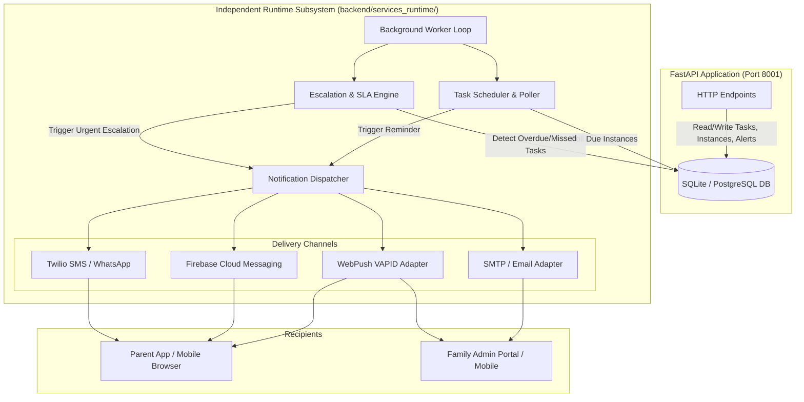

# Implementation Plan: `backend/services_runtime` Subsystem

## 1. Executive Summary & Goals

The **Family Wellness Flow** application currently manages child accounts, parent onboarding (via QR and 6-character short codes), care tasks, task instances, parent/caregiver task completions, alerts, and database-stored notifications.

The objective of this implementation plan is to introduce **real-world notification delivery** and **automated background execution** by architecting an independent subsystem:

```
backend/services_runtime/
```

### Core Tenets & Non-Negotiables:
- **Zero Disruption to Existing APIs**: The existing FastAPI endpoints (`/api/auth`, `/api/families`, `/api/parents`, `/api/tasks`, `/api/invites`, `/api/alerts`, `/api/notifications`) remain focused strictly on HTTP request/response lifecycles.
- **Zero Schema Breakages**: The existing database models (`CareTask`, `TaskInstance`, `ParentProfile`, `FamilyCircle`, `Notification`, `Alert`) are preserved. Any runtime state (e.g., delivery status, push subscriptions) is handled additively without altering existing foreign keys or core logic.
- **Decoupled Background Execution**: The runtime service can run either as a standalone worker daemon (`python -m services_runtime.worker`) or attach cleanly via FastAPI lifespan events without blocking incoming web traffic.
- **Multi-Channel Delivery Providers**: Modular, pluggable delivery adapters for WebPush (VAPID), Firebase Cloud Messaging (FCM), SMS (Twilio), and Email (SMTP/SendGrid).

---

## 2. Architecture & Data Flow



---

## 3. Subsystem Directory Structure

```
backend/services_runtime/
├── __init__.py
├── config.py                 # Provider credentials, poll intervals, VAPID keys, retry policies
├── models.py                 # Push subscription models & runtime delivery records (additive)
├── worker.py                 # Standalone daemon entrypoint (python -m services_runtime.worker)
├── lifespan.py               # Optional bridge to run runtime within FastAPI lifespan in dev mode
│
├── scheduler/
│   ├── __init__.py
│   ├── poller.py             # Periodic scanner for upcoming/due task instances
│   └── instance_generator.py # Automatic generation of daily instances for active recurring tasks
│
├── escalations/
│   ├── __init__.py
│   └── engine.py             # Escalation detector for tasks exceeding scheduled time / end time
│
└── delivery/
    ├── __init__.py
    ├── base.py               # Abstract NotificationProvider interface
    ├── dispatcher.py         # Multi-channel routing & retry coordinator
    ├── channels/
    │   ├── web_push.py       # WebPush provider (pywebpush with VAPID key pairs)
    │   ├── fcm.py            # Firebase Cloud Messaging HTTP v1 provider
    │   ├── sms.py            # Twilio SMS & WhatsApp provider
    │   └── email.py          # SMTP / SendGrid transactional email provider
    └── templates.py          # Friendly, gentle copy for reminders and escalations
```

---

## 4. Subsystem Components & Responsibilities

### 4.1 Runtime Configuration (`services_runtime/config.py`)
Loads runtime-specific settings with safe defaults:
- `POLL_INTERVAL_SECONDS` (default: `30` seconds)
- `ESCALATION_GRACE_PERIOD_MINUTES` (default: `15` minutes past scheduled time or end time)
- `WEBPUSH_VAPID_PUBLIC_KEY` & `WEBPUSH_VAPID_PRIVATE_KEY` & `WEBPUSH_CLAIMS_EMAIL`
- `FCM_CREDENTIALS_JSON` / `FCM_PROJECT_ID`
- `TWILIO_ACCOUNT_SID`, `TWILIO_AUTH_TOKEN`, `TWILIO_FROM_NUMBER`
- `SMTP_HOST`, `SMTP_PORT`, `SMTP_USER`, `SMTP_PASSWORD`, `SMTP_FROM_EMAIL`

### 4.2 Task Scheduler & Instance Poller (`services_runtime/scheduler/poller.py`)
- Runs on a non-blocking asynchronous loop (`asyncio.sleep(POLL_INTERVAL_SECONDS)`).
- Queries `TaskInstance` records for the current date where `status == "pending"`.
- Calculates current local time against the task instance `time` (and optional `end_time`).
- Emits a reminder dispatch if the scheduled window is reached and a reminder has not yet been recorded today.

### 4.3 Automated Escalation Engine (`services_runtime/escalations/engine.py`)
- Identifies task instances that remain uncompleted after their scheduled time window or `end_time` plus grace period.
- Automatically marks or flags instances that have transitioned into `missed` status.
- Generates an `Alert` record in the database categorized as `Escalation` or `Missed task`.
- Dispatches high-priority notifications to all connected family caregivers (children) and backup contacts.

### 4.4 Multi-Channel Delivery Providers (`services_runtime/delivery/`)
All channels inherit from `BaseNotificationProvider`:
```python
class BaseNotificationProvider(ABC):
    @abstractmethod
    async def send(self, recipient: RecipientContext, payload: NotificationPayload) -> DeliveryResult:
        pass
```

1. **WebPush Provider (`web_push.py`)**:
   - Uses standard RFC 8291 / 8292 Web Push encryption (`pywebpush`).
   - Supports browser-based push notifications on desktop, Android Chrome, and iOS PWA (Safari 16.4+).
2. **FCM Provider (`fcm.py`)**:
   - Supports native mobile push notifications for parent/child devices.
3. **SMS Provider (`sms.py`)**:
   - Dispatches emergency escalations via Twilio SMS when internet connectivity on parent devices is inactive.
4. **Email Provider (`email.py`)**:
   - Sends daily wellness digest summaries and critical escalation summaries to family admins.

### 4.5 Dispatcher & Resilience (`services_runtime/delivery/dispatcher.py`)
- **Deduplication**: Enforces idempotency keys (e.g., `task_{id}_{date}_reminder_{n}`) to guarantee no parent receives duplicate reminders for the same task instance.
- **Failover**: If WebPush fails or no active push token exists for a parent, gracefully falls back to SMS or database notifications.
- **Gentle Tone Guard**: Uses preset templates maintaining CareCircle's calm, reassuring voice (avoiding alarming or clinical phrasing).

---

## 5. Phased Implementation Roadmap

### Phase 1: Subsystem Scaffold & Configuration
- Create `backend/services_runtime/` package hierarchy.
- Implement `config.py` with environment variable loading and validation.
- Add required runtime dependencies to `backend/requirements.txt` (`pywebpush`, `cryptography`, `httpx`).

### Phase 2: Core Provider Abstraction & WebPush Implementation
- Define `BaseNotificationProvider`, `NotificationPayload`, and `DeliveryResult` in `delivery/base.py`.
- Implement `WebPushProvider` in `delivery/channels/web_push.py` with automatic VAPID keypair generation and caching.
- Create push subscription storage endpoint in FastAPI (`/api/notifications/push-subscribe`) that feeds the runtime provider without modifying core models.

### Phase 3: Scheduler & Poller Logic
- Implement `services_runtime/scheduler/poller.py` to scan active database sessions for due task instances.
- Build instance reminder deduplication cache.
- Integrate with `NotificationDispatcher` to trigger push alerts.

### Phase 4: Escalation & SLA Engine
- Implement `services_runtime/escalations/engine.py` to check overdue tasks past scheduled end times.
- Create automated `Alert` records linking to family members.
- Dispatch escalation alerts to child caregivers.

### Phase 5: Standalone Worker & Process Supervisor
- Implement `services_runtime/worker.py` with graceful shutdown signal handling (`SIGINT`, `SIGTERM`).
- Provide an optional FastAPI lifespan runner in `services_runtime/lifespan.py` for streamlined local development.
- Add CLI test commands to trigger simulated reminders and escalations on demand.

### Phase 6: End-to-End Verification & Testing
- Unit and integration tests for scheduler intervals and escalation rules.
- Test push payload receipt on web push clients.
- Verify zero regression in existing test suites.

---

## 6. Verification Plan & Test Strategy

| Test Case | Scenario | Expected Outcome |
|-----------|----------|-------------------|
| **Scheduler Polling** | Create task scheduled at current time `HH:MM` | Scheduler detects task, triggers dispatch, records idempotency key |
| **Deduplication** | Run poller 3 times within the same minute | Only 1 push notification dispatched to the parent |
| **Escalation Trigger** | Task scheduled time has passed + grace period | Instance marked missed, Alert record created, urgent notification dispatched to family admin |
| **Multi-Parent Dispatch** | Task assigned to multiple parents | All assigned parent devices receive individual personalized push notifications |
| **Graceful Shutdown** | Send `SIGINT` to worker process | Active dispatches complete, loop exits cleanly without zombie threads |
| **Zero Regression** | Existing API tests (`pytest`) | 100% existing authentication, parent, and task endpoints pass unchanged |

---

## 7. Approval & Next Steps

Upon review and confirmation of this implementation plan:
1. Proceed with **Phase 1** (creating `backend/services_runtime/` and adding lightweight runtime dependencies).
2. Scaffold the provider abstractions and scheduler loop.
3. Test with the running backend service.
